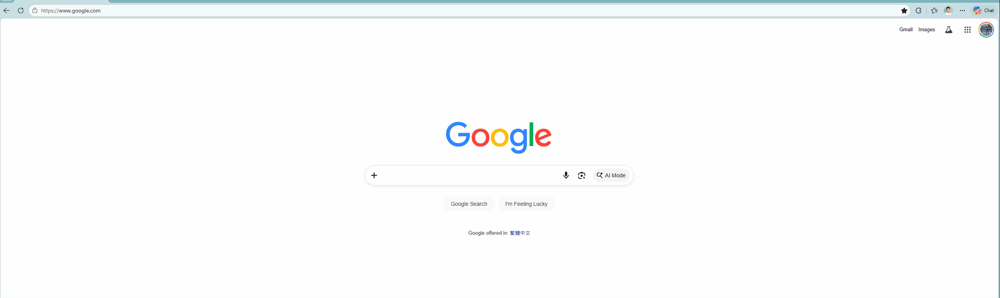

<div align="center">

# 💧 SlackTime

### *Your gentle nudge to drink water and stretch — without breaking your flow.*

A soft, non-blocking desktop reminder for Windows that slides quietly across
the top of every screen, then disappears. No pop-ups. No blocking. No nagging.

`Stay hydrated.` &nbsp;•&nbsp; `Stretch often.` &nbsp;•&nbsp; `Keep working.`

</div>

---

## 🎬 Demo

<div align="center">

<!--
  Drop a screen recording of the toast sliding in here.
  Record a short clip (right-click tray icon → "Remind now"), save it as
  docs/demo.gif, then this image will display it. Quick ways to capture:
    • Windows: Xbox Game Bar (Win+G) or ScreenToGif (https://www.screentogif.com/)
    • Keep it under ~5 seconds and a few MB so it loads fast on GitHub.
-->



*The toast softly slides in from the left, lingers, then glides away — on every monitor.*

</div>

---

## ✨ Why SlackTime?

Most reminder apps **interrupt** you — a modal dialog steals focus, a system
notification piles up in the Action Center, and you dismiss it without a second
thought. SlackTime is different:

| | |
|---|---|
| 🌊 **Soft & floating** | A small toast glides in from the left, holds for a moment, then slides away |
| 🚫 **Never blocks you** | It never steals focus or interrupts your typing — glance at it or ignore it |
| 🖥️ **Multi-monitor aware** | The reminder appears on **every** screen, perfectly centered on each |
| ⏱️ **Your rhythm** | Default every 40 minutes — adjustable to 15 / 20 / 30 / 40 / 60 / 90 |
| 🪶 **Lives in the tray** | Quietly runs in the background with a tiny water-drop icon |
| 🔁 **Starts at login** | Toggle "Start at login" right from the tray menu — Windows & macOS |
| 🍎 **Cross-platform** | Runs on Windows and macOS from the same code, via a thin platform layer |

---

## 🚀 Quick Start

### Option A — Just run it (Python)

Works on **Windows and macOS**:

```bash
pip install -r requirements.txt
python slacktime.py
```

> Tip (Windows): use `pythonw slacktime.py` to launch with **no console window**.

Once it's running, open the tray menu and tick **"Start at login"** — that's the
simplest way to have it launch automatically, on either OS.

### Option B — Build a standalone Windows app 🪄

No Python needed after building. Double-click:

```bash
build.bat
```

This builds `SlackTime.exe`, installs it to `%LOCALAPPDATA%\SlackTime`, and
adds a Startup shortcut so it **launches every time you log in**.

> **Why a folder, not a single .exe?** Corporate machines often run Application
> Control (WDAC/AppLocker) that blocks DLLs loaded from `%TEMP%`. The build uses
> PyInstaller's `--onedir` mode so everything lives in one fixed folder — no
> temp extraction, no policy errors.

> **macOS packaging** is not yet scripted. Run it with Python (Option A) for now;
> `pyinstaller --windowed` can produce a `.app` bundle when you're ready.

---

## 🎛️ Controls

Right-click the **💧 water-drop icon** in your system tray (menu bar on macOS):

```
💧 SlackTime
 ├─ Pause / Resume
 ├─ Remind now        ← preview the toast instantly
 ├─ Interval ▸        ← 15 · 20 · 30 · 40 · 60 · 90 min
 ├─ Start at login    ← ✓ launch automatically (Windows & macOS)
 └─ Quit
```

- Your chosen interval is **saved across restarts**.
- **Click any toast** to dismiss it early.

> Can't find the icon? On Windows 11 it may be tucked under the **`^`** (show
> hidden icons) arrow on the taskbar — drag it out to pin it.

---

## 🩹 Uninstall / Disable

| Goal | How |
|---|---|
| Stop it auto-starting | Untick **Start at login** in the tray menu (or, Windows: delete `SlackTime.lnk` from `shell:startup`; macOS: delete `~/Library/LaunchAgents/com.slacktime.reminder.plist`) |
| Quit it now | Right-click tray icon → **Quit** |
| Remove it completely (Windows) | Delete `%LOCALAPPDATA%\SlackTime` and the Startup shortcut |

---

## 🛠️ Built With

- **[tkinter](https://docs.python.org/3/library/tkinter.html)** — the floating toast & slide animation
- **[pystray](https://pypi.org/project/pystray/)** — the system-tray icon & menu (Windows)
- **[rumps](https://pypi.org/project/rumps/)** — the menu-bar app (macOS)
- **[Pillow](https://pypi.org/project/pillow/)** — draws the water-drop icon
- **[screeninfo](https://pypi.org/project/screeninfo/)** — finds every monitor
- **[PyInstaller](https://pyinstaller.org/)** — bundles it into a standalone app

OS-specific bits (the tray backend & main-thread ownership, toast styling,
fonts, auto-start) live in a small `platform_support/` package — `windows.py`
and `macos.py` behind a shared interface, so the core app stays single-source.

> **Why two tray backends?** On macOS, both tkinter and a tray library demand
> the main thread, so the Windows model (tray on a background thread) crashes.
> The macOS path uses **rumps** to own the main thread and pumps tkinter from a
> timer for the toast animation.

---

## 📄 License

Released under the [MIT License](LICENSE) — free to use, modify, and share.

---

<div align="center">

*Made to keep you hydrated, limber, and in the zone.* 💧🧘

**⭐ Star this repo if SlackTime keeps you healthy!**

</div>
